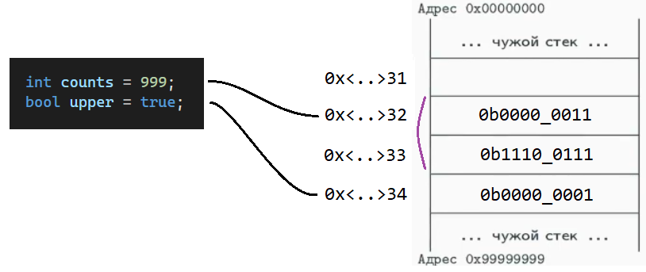

# Введение в классы и интерфейсы

## Обычная жизнь - Примитивы

Официальная документация: https://docs.microsoft.com/ru-ru/dotnet/csharp/language-reference/builtin-types/built-in-types

Любая переменная привязана к ячейке в памяти, где хранится какая-то информация.

- Для примитивов (типов значений) это будет исчерпывающая информация (хранится в **стеке**);
- Для объектов (ссылочных типов) это будет ссылка (идентификатор элемента, хранящегося в обработчике объектов, т.н. **куче**);

В этом уроке не объясняются механизмы работы стэка и кучи, изучить их можно тут: https://youtu.be/O-TvywJfo1I

### Данные в стэке

Основная особенность стековой памяти - её фиксированная величина, это ограничение сохраняется и для самих переменных. То есть нельзя "на лету" поменять значение переменной на другой тип, т.к. нет ей может не хватить выделнного места. Поэтому ЯП с динамической типизацией всегда медленнее, чем со статической.

В ВУ ЯП объявление переменной выглядит так:

```C#
int counts = 10;
```

Переменной тут является `counts`, значение — `10`. Полезное значение это `10`, **именно оно лежит в стеке**. Но кроме того ЯП дополнительно запоминает адрес этой переменной в стеке и её тип в некоторых случаях.

Частые разновидности примитивов и их объём (объем может изменяться в зависимости от платформы):

| Тип    | Размер (бит)             | Плавающая запятая |
|--------|--------------------------|-------------------|
| bool   | 8                        |                   |
| byte   | 8                        |                   |
| char   | 16 (По стандарту UTF-16) |                   |
| int    | 32                       |                   |
| double | 64                       | Да                |
| float  | 32                       | Да                |
| long   | 64                       |                   |

Кроме этих примитивов, которые хранят непосредственно полезные данные, существует ещё один тип **ссылка**, который является помощником для получения данных из кучи. Сама по себе ссылка тоже хранится в стеке.

Визуально в памяти показать стэк и отношение переменных к стэку можно так:


Если их поменять:



### Недостатки

- Отсутствие динамичности
- Отсутствие объединённости данных
