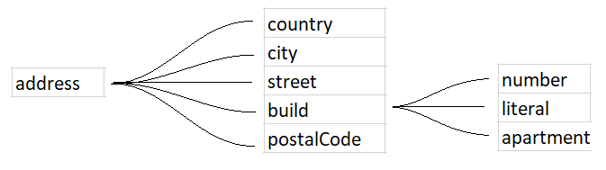
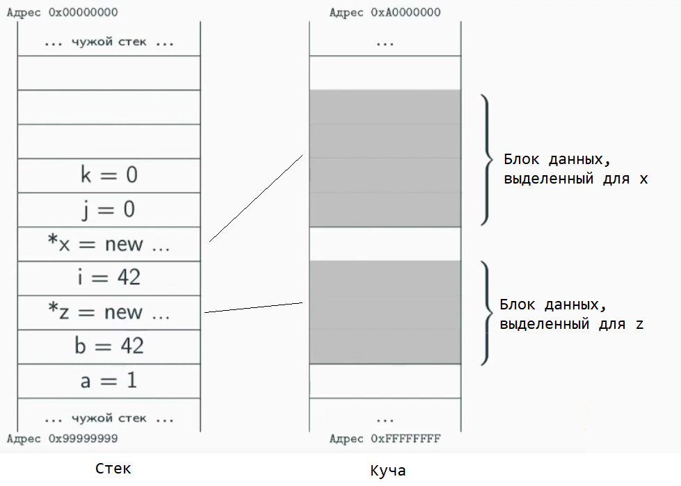

# Введение в классы и интерфейсы

## Классы и объекты

### Классы

Класс — это **декларация**, описание структуры данных. То есть сам по себе класс это только текст, описывающий то, как данные должны располагаться и обрабатываться.

Объект — это **реализация** класса. То есть элемент, структура которого соответствует описанному классу.

Классы созданы для упрощения жизни разработчику, благодаря котором он, а также его коллеги точно знают, какие данные хранятся в объекте или какие он может в него сохранить.

### Объекты

Объект это одна переменная, которая хранит в себе ещё несколько переменных. Получается древовидная структура, конец каждой ветки из которых всегда будет примитивной переменной.

По данным в объекте нужно перемещаться, то есть из переменной нужно как-то выбрать переменную уровнем ниже. В разных языках используются разные символы для этого, но сейчас популярнее всго символ `.`:

```C#
Address address = new Address(); // переменная address является объектом

address.country // переменная country является примитивом, находящимся внутри address

address.build.number // Объект может хранить в себе ещё объекты, тем самым увеличивая цепь вложенности

```

Так выглядит результирующие дерево вложенностей переменных в объекте:



### Принципы хранения объектов в памяти

Значение переменной объекта, как и примитива, хранится в стеке, однако его значение это ссылка на другую область памяти, выдающаяся динамически и обрабатывающаяся специальным механизмом используемого языка.



Куча в отличии от стека это область памяти, кусочки который выдаются в любой момент случайным образом, и в отличие от стэка, где обязательно заполнение данных последовательно, в куче выдаётся самый подходящий участок из всех доступных.
